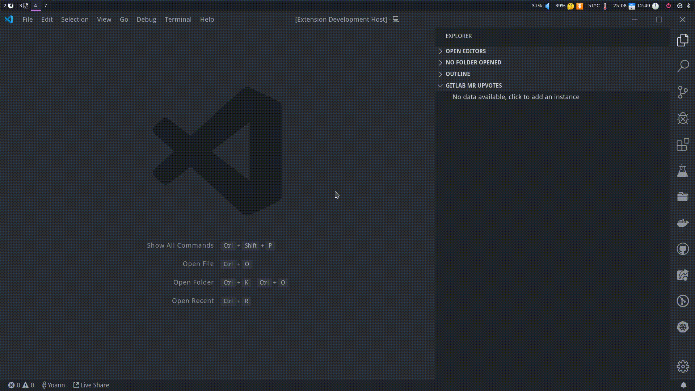
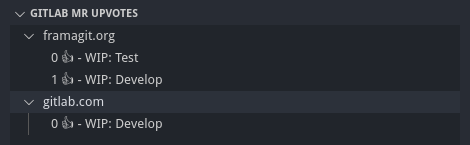

# Gitlab Merge Request Upvotes README

With **Gitlab Merge Request Upvotes** you can easily follow the upvotes on your
GitLab's <abbr title="Merge Request">MR</abbr>. The Tree View of the extension
will show you the upvotes on the <abbr title="Merge Request">MR</abbr> you
created by instances.

## Features

* Add GitLab instance
* Remove GitLab instance
* List GitLab instances in Tree View
  * Click on item to open the <abbr title="Merge Request">MR</abbr> web page.

### Tree View

Follow the upvotes in a dedicated preview. Items are clickable and will open 
the <abbr title="Merge Request">MR</abbr> in your default browser.

## Extension Settings

This extension contributes the following settings:

* `gitlabMergeRequestUpvotes.refreshInterval`: `number` of seconds between each
  refresh.

## Release Notes

See [CHANGELOG.md](./CHANGELOG.md)
